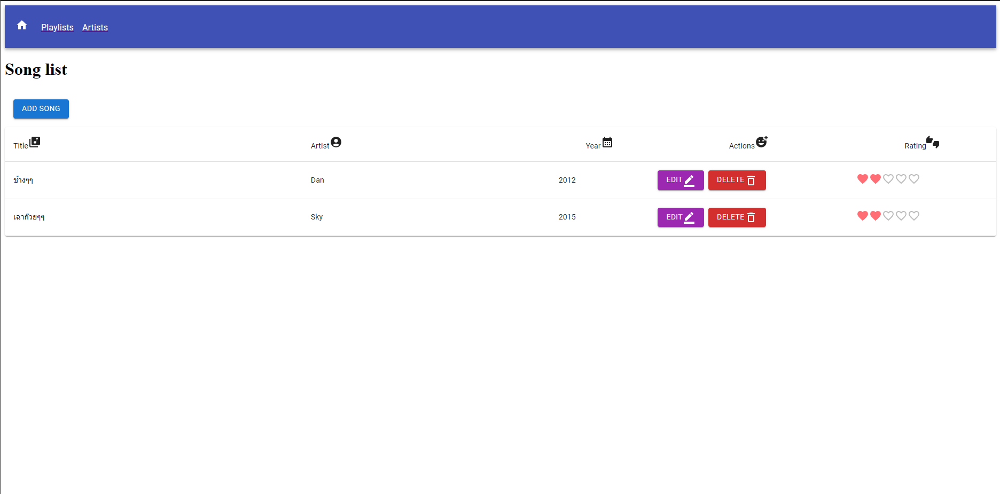
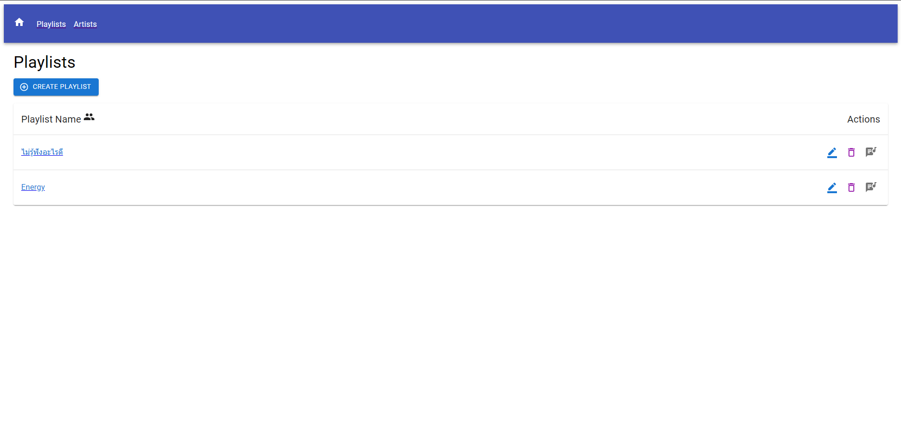
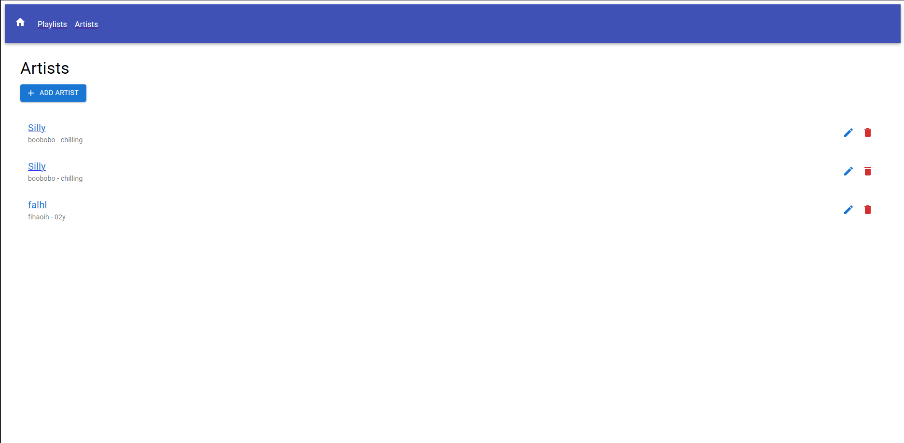

# SimpleStream Project

## Team Members
- CHATCHAI BUMRUNGSAK (https://github.com/ApP0s)
- BOONYARIT THONGMA (https://github.com/Rollupadopt)

## Project Description
SimpleStream is a streaming app that allows users to perform CRUD operations via a REST API. The app includes a Home page, Playlist, and Artists sections.

## Technologies and Tools
- 
- 
- 
- 
- 
- 
- 

## Screenshots




This is a [Next.js](https://nextjs.org) project bootstrapped with [`create-next-app`](https://nextjs.org/docs/app/api-reference/cli/create-next-app).

## Getting Started

First, Clone the repo:

```bash
git clone https://github.com/ApP0s/SimpleStream.git

```
Second, install dependencies:
```bash
npm install
# or
yarn install
# or
pnpm install
# or
bun install

```

Third, run the server:
```bash
npm run dev
# or
yarn dev
# or
pnpm dev
# or
bun dev

```

Open [http://localhost:3000](http://localhost:3000) with your browser to see the result.

You can start editing the page by modifying `app/page.js`. The page auto-updates as you edit the file.

This project uses [`next/font`](https://nextjs.org/docs/app/building-your-application/optimizing/fonts) to automatically optimize and load [Geist](https://vercel.com/font), a new font family for Vercel.

## Learn More

To learn more about Next.js, take a look at the following resources:

- [Next.js Documentation](https://nextjs.org/docs) - learn about Next.js features and API.
- [Learn Next.js](https://nextjs.org/learn) - an interactive Next.js tutorial.

You can check out [the Next.js GitHub repository](https://github.com/vercel/next.js) - your feedback and contributions are welcome!

## Deploy on Vercel

The easiest way to deploy your Next.js app is to use the [Vercel Platform](https://vercel.com/new?utm_medium=default-template&filter=next.js&utm_source=create-next-app&utm_campaign=create-next-app-readme) from the creators of Next.js.

Check out our [Next.js deployment documentation](https://nextjs.org/docs/app/building-your-application/deploying) for more details.
